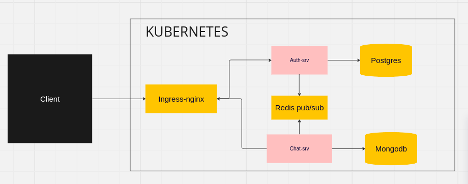

# Chafity
_A real time chat applications

## Introduction
Charity is microservice based real-time chat application,
Build using javascript/typescript for the backend service.

## Context
This project is my Portfolio project for [ALX-SWE](https://www.alxafrica.com/) backend specelatation

## Teams
I worked this project alone.
 - ***AYUB SHEIKH*** [@ayubsh](https://github.com/ayubsh)

## Architecture
### microservice Architecture
- User service: Handles user management and authentication (Node.js, PostgreSQL)

- Chat Service: Manages chat rooms, messages, and real-time communication (Node.js, PostgreSQL, Redis Pub/Sub)




## How to run
Make sure you have
- [Docker](https://www.docker.com/)
- [Kubernetes Minikube](https://minikube.sigs.k8s.io/)
- [Skaffold](https://skaffold.dev/)

```sh
git clone git@github.com:ayubsh/chatify.git
cd chatify

skaffold dev

```

set up environment variables in __.env__ file
```sh
POSTGRES_USER="db_user"
POSTGRES_HOST="db_host"
POSTGRES_PASSWORD="your_password"
POSTGRES_DATABASE="db_name"
```

# Acknowledgments
__The [ALXSE](https://www.alxafrica.com/) community, staff, cohort 11 and all [ALXSE](https://www.alxafrica.com/) students thanks for all For the help, advice and resources they provided me  during this project and during all our curriculum over the last year.__
